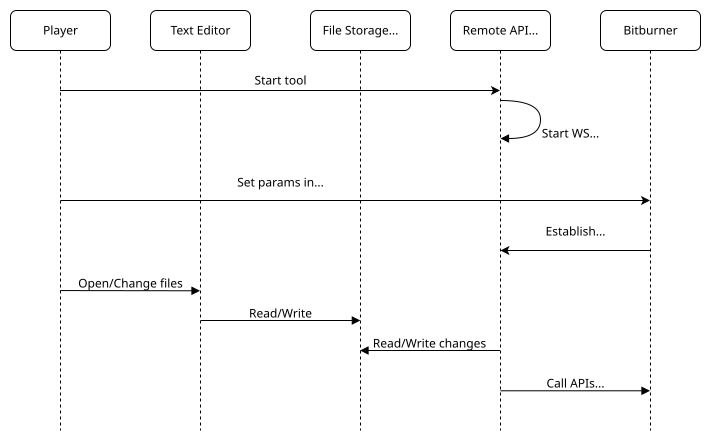

# Remote API

Bitburner can connect to a WebSocket server, and then that server can read and write Bitburner data via some APIs. The most common usage of this feature is to synchronize files between Bitburner and an external system. With a Remote API tool, you can write your scripts in any text editor and synchronize your scripts with Bitburner.

You only need to do 2 things:

- Start the Remote API tool.
- In Bitburner, Options -> Remote API. Set "hostname" and "port", then press "Connect".

## Community tools

All these tools support synchronizing scripts to Bitburner. Some tools support transpiling TypeScript/JSX to JavaScript.
Note that Bitburner has native support for TypeScript/JSX.

Links:

- [typescript-template](https://github.com/bitburner-official/typescript-template): A template for synchronizing Typescript/Javascript from your computer to the game.
- [viteburner](https://github.com/Tanimodori/viteburner): Daemon tools of bitburner using vite for script transform, file syncing, RAM monitoring and more!
- [bb-external-editor](https://github.com/shyguy1412/bb-external-editor): This tool uses esbuild to transpile and bundle your scripts. It supports JS, TS and React as well as importing from any browser-compatible npm library out of the box.
- [BitburnerGoFilesync](https://github.com/CTNOriginals/BitburnerGoFilesync): A standalone binary cli tool that doesn't require any setup or third party libraries. It is designed to be very minimal and easy to use out of the box.
- [VS Code Extension: Bitburner File Sync Plugin](https://github.com/ficocelliguy/bitburner-file-sync-plugin): A VS Code extension that syncs your local script files to Bitburner.

`typescript-template` and `BitburnerGoFilesync` both have a small set of options and features, their simplicity is by design.  
`viteburner`, `bb-external-editor`, and `VS Code Extension: Bitburner File Sync Plugin` have more fancy features and may offer more control for specific use cases.

## Troubleshooting tips

- Try to update the tool and restart it. Check error messages printed in the terminal to see what went wrong.
- When you turn off your machine or put it in sleep mode, the connection between Bitburner and the tool is closed. You have to connect again.
- Some external programs or browser extensions may interfere with the connection. For example, some antivirus programs and ad-blocker extensions may block the WebSocket connection.
- Some tools support a feature that is usually called "mirroring". You must read the instructions carefully before using it. This feature allows 2-way sync, but it may overwrite your scripts or other files _on your machine_ if you set it up wrong.
- If you need further help, please ask us on the [external-editors](https://discord.com/channels/415207508303544321/923428435618058311) channel.

## How it works

## API specification

All APIs use a request/response format similar to the JSON RPC 2.0 protocol.

Request:

        {
            "jsonrpc": "2.0",
            "id": number,
            "method": string,
            "params": any
        }

Success Response:

        {
            "jsonrpc": "2.0",
            "id": number,
            "result": any
        }

Error Response:

        {
            "jsonrpc": "2.0",
            "id": number,
            "error": string
        }

### pushFile

Create or update a file.

Request:

        {
            "jsonrpc": "2.0",
            "id": number,
            "method": "pushFile",
            "params": {
                "filename": string,
                "content": string,
                "server": string
            }
        }

Response:

        {
            "jsonrpc": "2.0",
            "id": number,
            "result": "OK"
        }

### getFile

Read a file and its content.

Request:

        {
            "jsonrpc": "2.0",
            "id": number,
            "method": "getFile",
            "params": {
                "filename": string,
                "server": string
            }
        }

Response:

        {
            "jsonrpc": "2.0",
            "id": number,
            "result": string
        }

### getFileMetadata

Read metadata of a file.

Request:

        {
            "jsonrpc": "2.0",
            "id": number,
            "method": "getFileMetadata",
            "params": {
                "filename": string,
                "server": string
            }
        }

Response:

        {
            "jsonrpc": "2.0",
            "id": number,
            "result": {
                "filename": string,
                "atime": string,
                "btime": string,
                "mtime": string
            }
        }

### deleteFile

Delete a file.

Request:

        {
            "jsonrpc": "2.0",
            "id": number,
            "method": "deleteFile",
            "params": {
                "filename": string,
                "server": string
            }
        }

Response:

        {
            "jsonrpc": "2.0",
            "id": number,
            "result": "OK"
        }

### getFileNames

List all file names on a server.

Request:

        {
            "jsonrpc": "2.0",
            "id": number,
            "method": "getFileNames",
            "params": {
                "server": string
            }
        }

Response:

        {
            "jsonrpc": "2.0",
            "id": number,
            "result": string[]
        }

### getAllFiles

Get the content of all files on a server.

Request:

        {
            "jsonrpc": "2.0",
            "id": number,
            "method": "getAllFiles",
            "params": {
                "server": string
            }
        }

Response:

        {
            "jsonrpc": "2.0",
            "id": number,
            "result": {
                "filename": string,
                "content": string
            }[]
        }

### getAllFileMetadata

Request:

Get the content of all files on a server.

        {
            "jsonrpc": "2.0",
            "id": number,
            "method": "getAllFileMetadata",
            "params": {
                "server": string
            }
        }

Response:

        {
            "jsonrpc": "2.0",
            "id": number,
            "result": {
                "filename": string,
                "atime": string
                "btime": string,
                "mtime": string,
            }[]
        }

### calculateRam

Calculate the in-game ram cost of a script.

Request:

        {
            "jsonrpc": "2.0",
            "id": number,
            "method": "calculateRam",
            "params": {
                "filename": string,
                "server": string
            }
        }

Response:

        {
            "jsonrpc": "2.0",
            "id": number,
            "result": number
        }

### getDefinitionFile

Get the definition file of NS APIs.

Request:

        {
            "jsonrpc": "2.0",
            "id": number,
            "method": "getDefinitionFile"
        }

Response:

        {
            "jsonrpc": "2.0",
            "id": number,
            "result": string
        }

### getSaveFile

Get save data.

Request:

        {
            "jsonrpc": "2.0",
            "id": number,
            "method": "getSaveFile"
        }

Response:

        {
            "jsonrpc": "2.0",
            "id": number,
            "result": {
                "identifier": string,
                "binary": boolean,
                "save": string
            }
        }

### getAllServers

Get all servers.

Request:

        {
            "jsonrpc": "2.0",
            "id": number,
            "method": "getAllServers"
        }

Response:

        {
            "jsonrpc": "2.0",
            "id": number,
            "result": {
                "hostname": string,
                "hasAdminRights": boolean,
                "purchasedByPlayer": boolean
            }[]
        }
